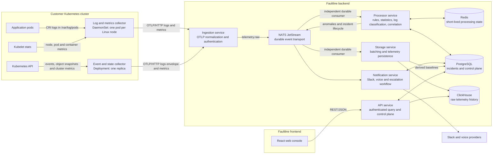
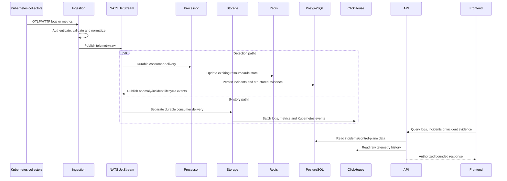

# Faultline system architecture and telemetry verification

This document describes the implementation currently present in the Faultline backend
and frontend. It focuses on the Kubernetes workloads installed by
`npm run cluster:onboard`, the telemetry they collect, where that telemetry appears in
the frontend, and the role of each stateful infrastructure service.

## Executive summary

- `cluster:onboard` installs **two collector workload types**, not necessarily exactly
  two pods. `faultline-collector-logs` is a DaemonSet and therefore creates one pod on
  every Linux node. `faultline-collector-events` is a one-replica Deployment and creates
  one pod for the cluster.
- The DaemonSet collects container logs plus kubelet node, pod, container, network, and
  filesystem metrics. The Deployment watches Kubernetes events, polls pod/deployment
  state, and collects cluster-state metrics.
- All three signals travel as OTLP/HTTP to ingestion, are published to NATS JetStream,
  and are independently consumed by the processor and storage applications.
- The storage application writes raw telemetry history to ClickHouse. The processor
  uses Redis for short-lived detection state and writes durable incidents and related
  control-plane state to PostgreSQL.
- The frontend directly shows raw logs. It also shows error logs and Warning Kubernetes
  events in incident evidence. Raw metric samples are returned by the incident-evidence
  API, but the current frontend does **not** render them.

## High-level architecture

### Telemetry data flow

The processor and storage paths deliberately use separate JetStream consumers. A
ClickHouse outage can delay telemetry persistence without stopping incident detection;
unacknowledged storage messages remain available for redelivery.

## What `cluster:onboard` deploys

The durable installation is generated from `deploy/kubernetes/kustomization.yaml` and
applied by `scripts/cluster.cjs`. It creates the `faultline-system` namespace, two
service accounts with read-only RBAC, collector configuration ConfigMaps, an agent-token
Secret, the following two workloads, and the cluster connection ConfigMap.

| Workload                     | Kubernetes form | Pod count          | Main responsibility                                                                                 |
| ---------------------------- | --------------- | ------------------ | --------------------------------------------------------------------------------------------------- |
| `faultline-collector-logs`   | DaemonSet       | One per Linux node | Read CRI container logs and kubelet metrics local to each node                                      |
| `faultline-collector-events` | Deployment      | One replica        | Watch cluster-wide Kubernetes events, poll selected object state, and collect cluster-state metrics |

Onboarding also creates short-lived verification resources which are not part of the
installed monitoring topology:

- a `faultline-connectivity-*` curl pod in `default`, deleted after testing whether the
  cluster can reach ingestion; and
- a `faultline-log-test` pod in the temporary `faultline-onboarding` namespace, deleted
  after its test log is found in ClickHouse.

The synthetic onboarding namespace is excluded from classification and incident
creation, so verification telemetry does not become a customer-facing alert.

## Telemetry collected by each workload

### 1. Log and metrics DaemonSet

Configuration: `deploy/kubernetes/collector-logs.yaml`  
Workload manifest: `deploy/kubernetes/logs.yaml`

#### Logs

The `filelog` receiver reads `/var/log/pods/*/*/*.log` from the node. It parses the CRI
container format and enriches each record with available Kubernetes identity:

- cluster ID;
- namespace, pod name and pod UID;
- node and container name/ID;
- owning Deployment, ReplicaSet, StatefulSet, DaemonSet, or Job; and
- selected `app.kubernetes.io/name` and `app.kubernetes.io/component` pod labels.

Logs from `faultline-system` are excluded to avoid the collectors ingesting their own
output. File offsets are checkpointed under `/var/lib/faultline-collector`, so a
collector restart does not normally replay every log file. At ingestion, severity is
normalized to `trace`, `debug`, `info`, `warn`, `error`, `fatal`, or `unknown`.

#### Metrics

The `kubeletstats` receiver samples every 15 seconds for the node, pod, and container
metric groups. Depending on what the kubelet/runtime exposes, this includes:

- container, pod, and node CPU and memory usage;
- pod and node network receive/transmit counters; and
- filesystem usage/capacity metrics.

Common canonical names used by Faultline include
`k8s.container.cpu.usage` and `k8s.container.memory.usage`. Network and filesystem
signals retain their collector names after the `container.*` to `k8s.container.*`
canonicalization rule. Missing runtime metrics remain missing; Faultline does not
manufacture zero values.

### 2. Event and state Deployment

Configuration: `deploy/kubernetes/collector-events.yaml`  
Workload manifest: `deploy/kubernetes/events.yaml`

#### Kubernetes events

The `k8sobjects` receiver watches core `events` across the cluster and ignores watch
bookmarks, deletes, and watch errors. Ingestion converts each Kubernetes Event to a
normalized record containing:

- `Normal` or `Warning` type;
- reason and message/note;
- occurrence timestamp and repeat count;
- involved resource API version, kind, name, namespace, and UID; and
- available cluster, namespace, pod, node, workload, and container identity.

Examples include `BackOff`, `OOMKilling`, `FailedScheduling`, `FailedMount`,
`Unhealthy`, and `Evicted` when Kubernetes emits them.

#### Object-state snapshots

Every 15 seconds, the second `k8sobjects` receiver polls Pods and Deployments. Before
export, it strips the object down to kind, API version, identity, and status. Ingestion
then turns the selected status fields into structured metric events rather than storing
the entire Kubernetes objects as log text. These snapshots supply actual readiness,
container state/last termination reason, and unavailable Deployment replica counts.

#### Cluster-state metrics

The `k8s_cluster` receiver samples every 15 seconds. A filter retains only these metric
families, which ingestion converts to the canonical Faultline vocabulary where an alias
exists:

| Signal group            | Canonical examples                                                                                                   |
| ----------------------- | -------------------------------------------------------------------------------------------------------------------- |
| Container configuration | `k8s.container.cpu.limit`, `k8s.container.cpu.request`, `k8s.container.memory.limit`, `k8s.container.memory.request` |
| Container state         | `k8s.container.ready`, `k8s.container.restart_count`, `k8s.container.state`                                          |
| Pod state               | `k8s.pod.phase`, `k8s.pod.ready`                                                                                     |
| Deployment state        | `k8s.deployment.replicas.desired`, `k8s.deployment.replicas.available`, `k8s.deployment.replicas.unavailable`        |
| Node state              | `k8s.node.condition_*`, including Ready, MemoryPressure, DiskPressure, PIDPressure, and NetworkUnavailable           |

Both collectors export gzip-compressed OTLP/HTTP JSON with the registered cluster ID
and agent token. The event collector uses an OTLP logs envelope for Kubernetes Events
and object snapshots because that is how the OpenTelemetry objects receiver emits them;
ingestion distinguishes event objects, state snapshots, and ordinary application logs.

## Where telemetry is stored and shown in the frontend

### Backend storage and API

The ingestion service normalizes every accepted signal and publishes it to
`telemetry.raw`. The storage service batches the three kinds independently into these
ClickHouse tables:

| Signal                     | ClickHouse table              | API route                          |
| -------------------------- | ----------------------------- | ---------------------------------- |
| Application/container logs | `telemetry_logs`              | `GET /telemetry/logs`              |
| Metrics                    | `telemetry_metrics`           | `GET /telemetry/metrics`           |
| Kubernetes events          | `telemetry_kubernetes_events` | `GET /telemetry/kubernetes-events` |

The API also combines the signals through
`GET /resources/:resourceId/timeline` and `GET /incidents/:id/evidence`. All telemetry
queries require an authorized cluster scope and bounded time range.

### Current frontend coverage

| Signal/view                      | Shown now? | Frontend location                                  | What is actually rendered                                                                                        |
| -------------------------------- | ---------- | -------------------------------------------------- | ---------------------------------------------------------------------------------------------------------------- |
| Raw logs                         | Yes        | `src/pages/RuntimeMonitoringPage.jsx`              | Up to 250 stored log records from the selected cluster's last hour, polled and filterable by severity/local text |
| Incident error logs              | Yes        | `src/pages/IncidentDetailPage.jsx`                 | Error/fatal logs returned by the incident evidence endpoint                                                      |
| Incident Kubernetes events       | Yes        | `src/pages/IncidentDetailPage.jsx`                 | Warning events returned by the incident evidence endpoint                                                        |
| Derived anomalies/incidents      | Yes        | Alerts, Incident Ledger, and incident detail pages | Processor results read from PostgreSQL; these may have been produced from logs, metrics, or Kubernetes events    |
| Raw metrics                      | **No**     | No current page                                    | The evidence endpoint returns `telemetry.metrics`, but `EvidencePanel` does not read or render it                |
| General Kubernetes event browser | **No**     | No current page                                    | A client function exists, but no page calls it                                                                   |
| Resource timeline                | **No**     | No current page                                    | A client function and backend route exist, but no page calls it                                                  |

The frontend API functions are in `src/api/endpoints.js`: `searchLogs`, `queryMetrics`,
`searchKubernetesEvents`, `getResourceTimeline`, and `getIncidentEvidence`. Only
`searchLogs` and `getIncidentEvidence` are currently used by pages. Therefore, metrics
can affect alerts and incidents and can be retrieved through the backend, but there is
no raw metric chart/table in the current UI.

## Purpose of the stateful infrastructure

### ClickHouse: telemetry history and investigation

ClickHouse stores the high-volume, time-series-like raw history: normalized logs,
metrics, and Kubernetes events. It is optimized for time-window and resource-filtered
queries, batching, compression, deduplication, and per-signal retention TTLs. The API
uses it for runtime logs, incident evidence, metric queries, Kubernetes-event queries,
and resource timelines. It is not the incident/control-plane database.

### NATS JetStream: durable asynchronous transport

NATS with JetStream decouples producers and consumers. Ingestion publishes normalized
telemetry to a file-backed stream; processor and storage each have their own durable
consumer and therefore both receive every telemetry message. JetStream provides
at-least-once delivery, retry/redelivery, duplicate suppression within its configured
window, and dead-letter subjects. It also carries anomaly and incident lifecycle events
to downstream consumers such as notification handling.

### Redis: fast, expiring detection state

Redis is the processor's operational working memory. It stores expiring resource state,
restart deltas, rule observation windows/counters, active anomaly state, statistical
sample windows, log-classification aggregation, evidence windows, and processed-message
claims used for idempotency. This state is intentionally short-lived and rebuildable;
Redis is not the permanent incident system of record.

### PostgreSQL: durable transactional control plane

PostgreSQL is the durable system of record for incidents and application/control-plane
data: incident lifecycle and structured evidence references, clusters and projects,
users/RBAC/audit records, subscriptions, baselines, notification state and attempts,
on-call data, Slack configuration, acknowledgements, and related reporting data. Raw
logs and metrics are deliberately not stored here. Incident evidence keeps telemetry
event IDs and resource/time references, and the API resolves the raw records from
ClickHouse when needed.

## Code map

### Backend

| Concern                                             | Location                                                                                                                                   |
| --------------------------------------------------- | ------------------------------------------------------------------------------------------------------------------------------------------ |
| Onboarding orchestration and verification           | `scripts/cluster.cjs`                                                                                                                      |
| Kubernetes installation composition                 | `deploy/kubernetes/kustomization.yaml`                                                                                                     |
| DaemonSet and its collector pipeline                | `deploy/kubernetes/logs.yaml`, `deploy/kubernetes/collector-logs.yaml`                                                                     |
| Event Deployment and its collector pipeline         | `deploy/kubernetes/events.yaml`, `deploy/kubernetes/collector-events.yaml`                                                                 |
| Read-only collector permissions                     | `deploy/kubernetes/rbac.yaml`                                                                                                              |
| Temporary verification workload                     | `deploy/kubernetes/onboarding-test.yaml`                                                                                                   |
| OTLP endpoints and normalization                    | `apps/ingestion/src/otlp/otlp.controller.ts`, `apps/ingestion/src/otlp/translate.ts`, `apps/ingestion/src/otlp/metrics.ts`                 |
| JetStream implementation and topics                 | `packages/queue/src/index.ts`                                                                                                              |
| Detection, classification, and incident publication | `apps/processor/src/telemetry.consumer.ts`                                                                                                 |
| Redis-backed processor state                        | `apps/processor/src/resource-state`, `apps/processor/src/rules`, `apps/processor/src/statistical`, `apps/processor/src/log-classification` |
| ClickHouse telemetry consumer                       | `apps/storage/src/telemetry-storage.consumer.ts`                                                                                           |
| ClickHouse schema and queries                       | `packages/clickhouse/src/schema.ts`, `packages/clickhouse/src/store.ts`                                                                    |
| Raw telemetry and timeline API                      | `apps/api/src/telemetry.controller.ts`                                                                                                     |
| Incident-to-telemetry bridge                        | `apps/api/src/incident-evidence.controller.ts`                                                                                             |
| PostgreSQL schema and repositories                  | `packages/database/migrations`, `packages/database/src`                                                                                    |
| Local infrastructure definitions                    | `compose.infrastructure.yml`                                                                                                               |

### Frontend

The frontend paths below are relative to the separate
`Faultline-Frontend/Faultline_frontend` repository.

| Concern                      | Location                                               |
| ---------------------------- | ------------------------------------------------------ |
| Backend route wrappers       | `src/api/endpoints.js`                                 |
| Backend-to-UI data adapters  | `src/api/adapters.js`                                  |
| Raw runtime log screen       | `src/pages/RuntimeMonitoringPage.jsx`                  |
| Incident evidence rendering  | `src/pages/IncidentDetailPage.jsx`                     |
| Derived alert/incident lists | `src/pages/AlertsPage.jsx`, `src/pages/LedgerPage.jsx` |
| Registered-cluster view      | `src/pages/DeploymentsPage.jsx`                        |
| Route and plan gating        | `src/app/App.jsx`, `src/auth/guards.jsx`               |

## Verification conclusion

The backend collection and persistence path covers logs, metrics, and Kubernetes events.
The frontend coverage is only partial: logs have a dedicated runtime screen, and logs
plus Kubernetes Warning events are shown as incident evidence. Metrics currently support
processing, incident generation, backend querying, and evidence responses, but the UI
does not display the returned metric samples. A future telemetry page can use the
already-defined `queryMetrics`, `searchKubernetesEvents`, and `getResourceTimeline`
client functions instead of adding new backend endpoints.
